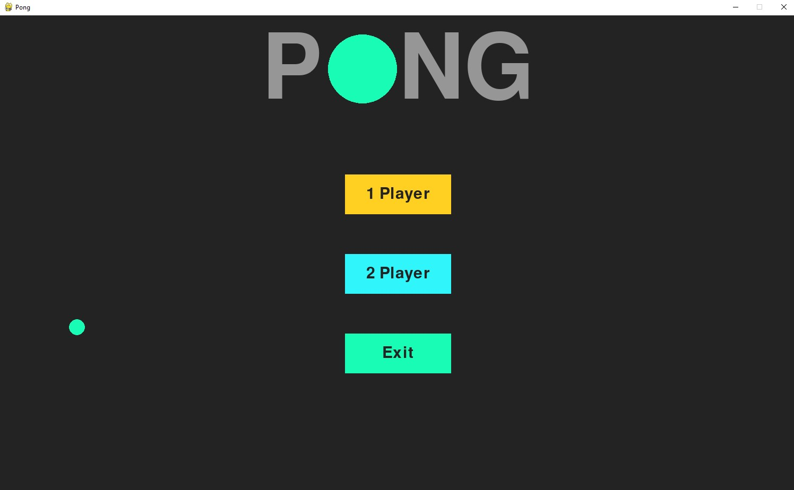
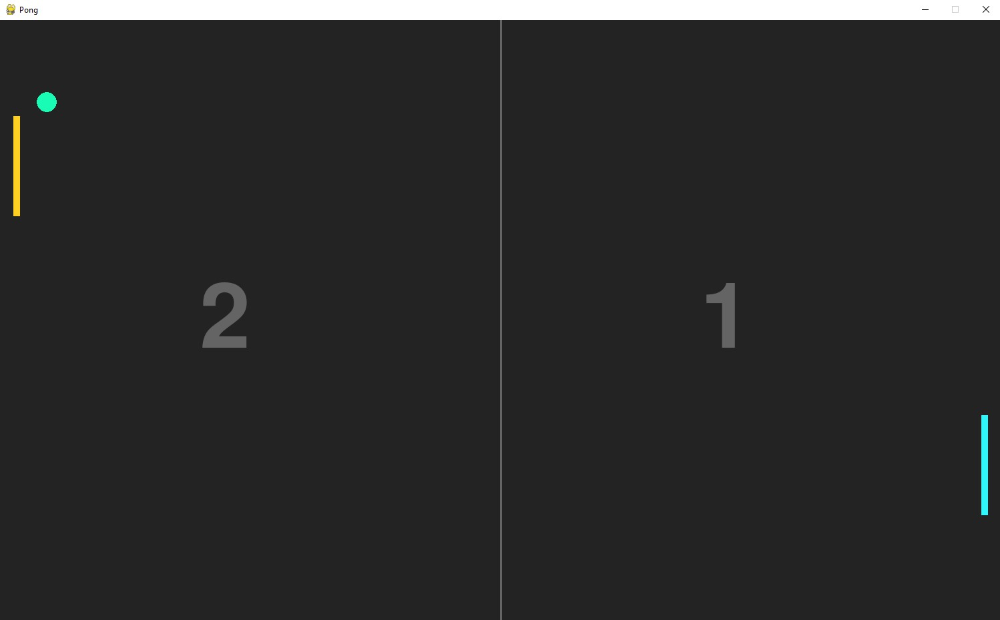

# Pong
This program is meant as a means for me to further familiarize myself with the python programming language. For this project I recreated the classic game of Pong. The game will start up into a menu in which it will display buttons to start a single player game, a local multiplayer game, and to exit the program. The menu will also display the title of the game at the top and will show a ball bouncing around the screen.

## Controls
Use W & S to move the orange, player 1 paddle up and down. 
Use the Up & Down arrow keys to move the blue, player 2 paddle up and down.
Game will prompt player(s) to either return to menu or to start another game once the score limit of 7 is reached.

## Screenshots
The Game Menu: 

The multplayer mode: 

## Author
* [Tanner Coker](https://github.com/UrbanFr0sty)
